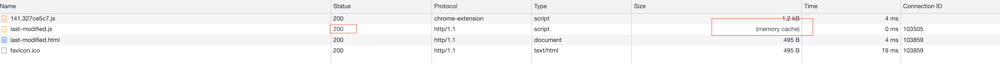

# 前端缓存之HTTP缓存

缓存是提升 Web 性能的重要手段，前端缓存可以看作是 HTTP 缓存和浏览器缓存的结合，本文将结合简单的 Nodejs 例子深入理解 HTTP 缓存的作用。


# 分级缓存策略


# HTTP缓存

HTTP 缓存策略分为强缓存和协商缓存两种，在 HTTP 中设置对应首部字段进行控制。强缓存由 Expires 或 Cache-Control 控制，协商缓存基于 Last-Modified 或 Etag 控制。

## Expires

HTTP 首部字段分为以下四种类型：

- 通用首部字段（请求报文和响应报文都会使用的首部）

| 字段名 | 说明 |
| --- | --- |
| Cache-Control | 控制缓存的行为 |
| Date | 创建报文的日期时间 |
- 请求首部字段（请求报文使用的首部）

| 字段名 | 说明 |
| --- | --- |
| If-Modified-Since | 浏览器存储的服务端返回的 Last-Modified 的取值，后续会用来比较是否更新浏览器的缓存资源，拥有秒级别的比较粒度 |
| If-None-Match | 同上，但是这个字段粒度会更细，以文件内容是否更新为比较依据 |
- 响应首部字段（响应报文使用的首部）

| 字段名 | 说明 |
| --- | --- |
| ETag | 资源的匹配信息 |
| Location | 指定的是需要将页面重新定向至的地址 |
- 实体首部字段（针对报文实体部分使用的首部）

| 字段名 | 说明 |
| --- | --- |
| Expires | 实体主体过期的绝对日期时间 |
| Last-Modified | 资源最后修改日期时间 |

Expires 是 HTTP/1.0 的产物，属于实体首部字段。Expires 使用绝对时间标识该资源的过期时间，修改本地时间可能造成缓存失效。Cache-Control 优先级高于 Expires，设置 Cache-Control 会导致 Expires 被忽略。

```jsx
if(request.url === '/expires.js'){
  deadline = new Date(Date.now() + 100000).toGMTString();
  response.writeHead(200, {
      'Content-Type': 'text/javascript',
      'Expires': deadline,
  });

  response.end("console.log('qianxun load !!!')");
}
```


## Cache-Control

Cache-Control 是 HTTP/1.1 的产物，属于通用首部字段，可以在请求头或响应头中设置，优先级高于 Expires。Cache-Control 有很多参数，常用参数如下。

### 可缓存性

public: 响应内容可被客户端、代理服务器等任意节点缓存

private: 客户端可缓存，代理服务器不可缓存，设置后 s-maxage 失效

no-store: 不使用任何缓存

no-cache: 请求首部表示不直接使用缓存，向服务器发起请求；响应首部时客户端可以缓存资源，需要通过协商缓存向服务器确认有效性

must-revalidate: 如果缓存不过期可以使用，过期了需要向服务器验证有效性。与 no-cache 的区别是 must-revalidate 是过期了才去验证，no-cache 是每次请求时都需要进行校验。

### 过期时间

max-age: 单位秒(s)，优先级高于 Expires，使用相对时间设置缓存到多少秒后过期

### Webpack为什么新增Hash值？

```jsx
const http = require('http');
const fs = require('fs');
const port = 3010;

http.createServer((request, response) => {
    console.log('request:', request.url);

    if(request.url === '/expires.html' || request.url === '/favicon.ico'){
        const html = fs.readFileSync('expires.html', 'utf-8');
        response.writeHead(200, {
            'Content-Type': 'text/html'
        })
        response.end(html);
    }else if(request.url === '/script.js'){
        response.writeHead(200, {
            'Content-Type': 'text/javascript',
            'Cache-Control': 'max-age=200'
        });
				// 修改 response.end("console.log('script load !!!')");
        response.end("console.log('qianxun load !!!')");
    }
}).listen(port, '127.0.0.1');
```

设置 'Cache-Control': 'max-age=200’ 进行浏览器缓存，第一次运行正常响应，修改服务器文件返回值并重启服务，再次获取内容从浏览器内存中获取，并未获取最新修改内容，这是为什么呢？


由于我们请求的 url 并没有发生变化，按照浏览器分级策略我们会先在浏览器缓存中寻找，寻找成功后直接返回资源，并未向服务器发起真正的请求，查看请求图发现并未请求/script.js。这显然是个问题，我们如何解决这个问题呢？webpack 在打包时会给资源文件加上一串 hash 码，内容改变时 hash 值会发生变化，反映到页面上就是 文件url 发生了变化，这样就可以达到更新缓存到目的了。


### 缓存新鲜度

Expires 和 Cache-Control 缓存单位都是以时间来进行计算的，把缓存内容的有效性等效于食品是否新鲜来看待，我们知道绝对食品是否新鲜取决于生产日期、当前日期、保质期，那么决定缓存是否新鲜取决于什么呢？正如上面例子所示，通过时间维度是无法判断服务端文件内容发生变化的，除了利用 webpack 新增 hash 码解决外，我们还可以通过协商缓存来处理，这会在后面的内容介绍。

```jsx
强缓存是否新鲜 = 缓存新鲜度 > 缓存使用期

缓存新鲜度 = max-age || (expires - date)

缓存使用期 = 响应使用期 + 传输延迟时间 + 停留缓存时间

响应使用期 = max(apparent_age, age)
apparent_age = max(0, response_time - date)

传输延迟时间 = response_time - request_time

停留缓存时间 = now - response_time
```

上述各字段解释：

| 变量名 | 说明 |
| --- | --- |
| max-age | Cache-Control 中的 maxage ｜ s-maxage |
| expires | Expires 值 |
| date | 服务器返回创建报文的日期时间 |
| age | Age 源服务器多久前创建了响应或在代理服务器中存储时长 |
| response_time | 浏览器缓存收到响应的本地时间 |
| request_time | 浏览器缓存发起请求的本地时间 |
| now | 电脑客户端当前时间 |

根据上述公式的演变，我们确定了 Expires 和 max-age 是会受到本地时间的影响的。那么 max-age 相比 Expires 有什么优势吗？我们可以直接看作是相对时间相比绝对时间的优势。

### 启发式缓存(Last-Modified/If-Modified-Since)

```jsx
if(request.url === '/last-modified.js'){
        const filePath = path.join(__dirname, request.url); // 拼接当前脚本文件地址
        const stat = fs.statSync(filePath); // 获取当前脚本状态
        const mtime = stat.mtime.toGMTString() // 文件的最后修改时间
        const requestMtime = request.headers['if-modified-since']; // 来自浏览器传递的值

        console.log(stat);
        console.log(mtime, requestMtime);

        // 走协商缓存
        if (mtime === requestMtime) {
            response.statusCode = 304;
            response.end();
            return;
        }

        // 协商缓存失效，重新读取数据设置 Last-Modified 响应头
        console.log('协商缓存 Last-Modified 失效');
        response.writeHead(200, {
            'Content-Type': 'text/javascript',
            'Last-Modified': mtime,
        });

        const readStream = fs.createReadStream(filePath);
        readStream.pipe(response);
    }
```

执行上述脚本后发现发现，请求并没有执行到服务端，而是使用了强缓存，为什么会这样呢？这是因为浏览器默认启用了一个启发式缓存，缓存新鲜度 = max-age || (expires - date) 中关键信息缺失，仍会进行到强缓存，它的一个缓存时间是用 Date - Last-Modified 的值的 10% 作为缓存时间。



我们要达到 304 的效果，不走强缓存直接走协商缓存，修改我们的响应，设置 Cache-Control=max-age=0 ，修改后再次执行结果如下：

```jsx
response.writeHead(200, {
    'Content-Type': 'text/javascript',
    'Last-Modified': mtime,
    'Cache-Control': 'max-age=0', // 忽略启发式缓存
});
```


Tip: 除了启发式缓存外，针对内联 base64 图片会直接缓存在内存中，如果 base64 图片较大也会导致网页加载慢，可以使用 webpack loader，根据文件大小决定要不要做成内联 base64。

### 缓存代理服务

s-maxage: 使用公共服务器缓存，设置后忽略 Expires、max-age 指令

proxy-revalidate: 与 must-revalidate 相似，区别是代理服务器回源服务器校验，客户端不必回源服务器校验

no-transform: 禁止对资源做优化处理

only-if-cached：只接受代理服务器缓存，不接受源服务器响应。如果代理上没有缓存或者缓存过期，给客户端返回504（Gateway Timeout）


源服务器缓存控制


客户端缓存控制


### Etag 和 If-None-Match

在了解 Etag 之前我们先考虑一下 Last-Modified 有什么弊端。Last-Modified 根据文件修改时间来判断，单位是秒。加入我们操作是毫秒级别，Last-Modified 颗粒度就不满足我们现在的诉求。还有一种情况，服务器资源确实被修改了，但实质的内容并没有发生变化，这个时候 Last-Modified 也会更新，但这种情况我们并不希望浏览器去重新加载资源。在这些特殊场景下，我们就需要使用 Etag。Etag 优先级高于 Last-Modified，操作流程与 Last-Modified。

Etag 是根据文件内容是否修改来进行判断，通过 Hash 算法生成对应的 Etag 值。生成 Etag 值有两种方式：

1. 使用文件大小和修改时间
2. 使用文件内容的 hash 值和内容长度

上诉方式生成了强 Etag 值，不论实体发生多么细微的差距都会改变。我们也可以通过开启 weak 为 true 生成弱 Etag 值，这样只有资源发生根本改变后值才会改变，开启弱校验的 Etag 值会在开始处附加W/。

 

有了上面知识储备后，我们梳理整个 HTTP 缓存流程如下：


## 用户操作与浏览器缓存

|  | 说明 | 操作(Mac) |
| --- | --- | --- |
| 正常重新加载 | 加上cache-control: max-age=0 | 点击刷新 / Command + R |
| 硬性重新加载 | 加上cache-control: no-cache 和 pragma: no-cache禁用缓存 | Command + Shift + R |
| 清空缓存并硬性重新加载 | 清空浏览器缓存后再向服务器发起请求 | 打开开发者工具右键刷新按钮 |

用户不同的操作可以控制是否采用缓存，我们思考一下，随着 HTTP/1.1 协议的完善，新增了很多 Methond，什么条件的资源有必要进行缓存呢？

1. GET 请求响应状态为 200 的资源，通常为图片、Css
2. 永久重定向资源：响应状态码 301
3. 错误响应资源：404 响应页面

参考资料

[https://mp.weixin.qq.com/s/WXdl8yoGQqMNfIDPqSQ75Q](https://mp.weixin.qq.com/s/WXdl8yoGQqMNfIDPqSQ75Q)