# 浏览器导航流程

设备之间能完成通信需要经历一个复杂的过程，本文通过浏览器导航流程介绍常用的 DNS、HTTP协议、TCP/IP 等常用协议，并将导航流程与渲染流程内容整合，本文主要聚焦在上层应用，忽略硬件相关知识。

## URL 请求过程
### 解析 URL
> 地址栏判断输入内容是关键字还是请求的 URL，如果是关键字将使用默认搜索引擎进行关键字内容信息检索，是请求 URL 将构建完整的 URL，http 端口号默认设置80。按下回车后会触发 beforeunload 事件，这个事件中我们可以做取消导航、页面退出前数据清理操作，但此时页面并不会更新，在提交文档阶段页面内容才会更新。

### 构建请求
浏览器进程通过 IPC  将 URL 请求发送至网络进程，委托网络进程完成资源下载。Chrome 会在这个阶段构建请求头如下：
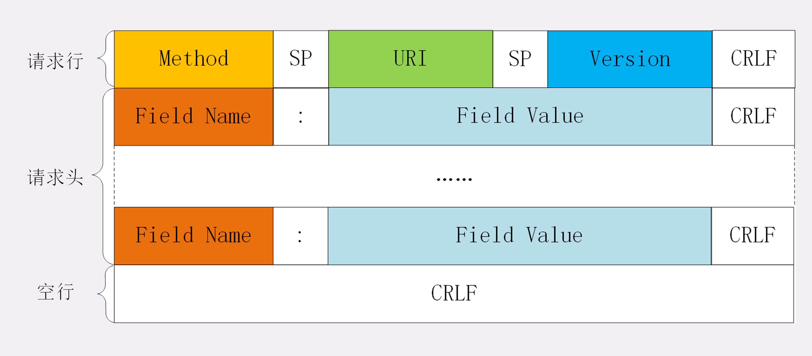

### 查找缓存
> 有资源返回资源给浏览器进程，导航流程结束；无资源则进行真正的网络请求。

### 准备 IP 和 端口号
为什么需要DNS
> 计算机之间通过 IP 地址进行通信，但 IP 地址对于人来说就是一段没有意义的数字，记忆 IP 地址对我们来说是困难的，所以我们使用域名来标记目标地址(www.baidu.com)，而 DNS 就是人与机器之间通信的桥梁， 负责管理 IP 地址和域名映射关系，DNS又称‘域名系统’。

DNS 解析过程：DNS解析过程分为递归和递归与迭代结合两种，下面介绍的是常使用的递归与迭代结合的方式。

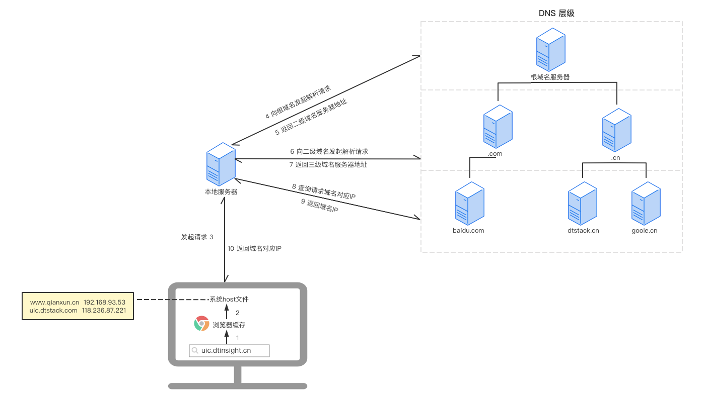

浏览器缓存：chrome://net-internals/#dns

Mac host 文件：/private/etc/hosts

### 等待 TCP 队列
> Chrome 有个机制，同一个域名中同时只能建立 6 个 TCP 连接。

### 建立TCP 连接
HTTP 与 TCP 之间的关系
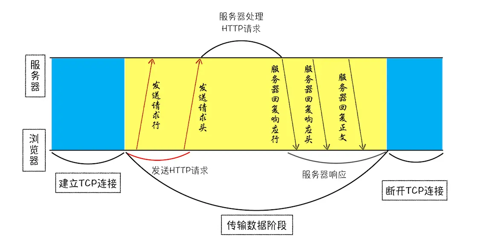

三次握手状态变更如下：

CLOSED: 关闭

SYN-SENT:同步已发送状态

SYN-RCVD:同步收到状态

LISTEN:监听状态

ESTABLISHED: 建立连接
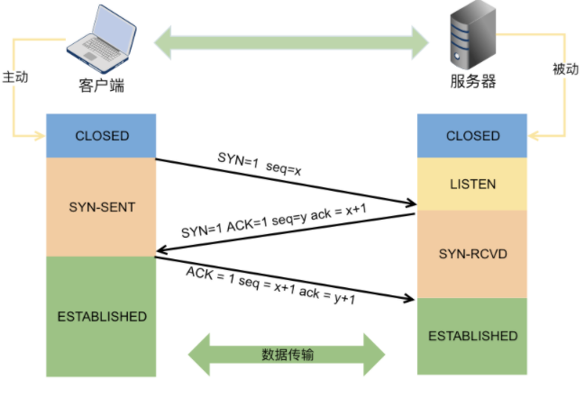

### 发送 HTTP 请求
HTTP 解决了什么问题？

> 让人与机器的交流。所以 HTTP 最开始设计就要求是简单的、灵活的、容易上手的。

HTTP 0.9
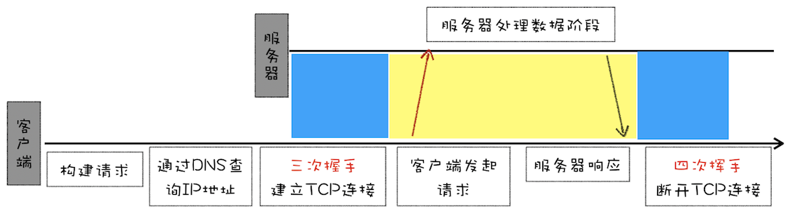

只有一个简单的 Get 请求行，通过 Get /index.html 命令向服务器发起请求，服务器响应 ASCII 编码的 HTML 文档，服务器返回内容后关闭连接。 

HTTP 1.0

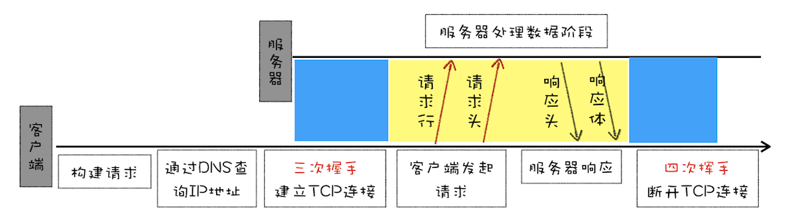

1) 随着互联网的发展，我们对图片、Css、JavaScript 等资源有了诉求，为了支持多种类型文件的下载 HTTP 1.0 引入了请求头、响应头。常见文件处理字段如下：

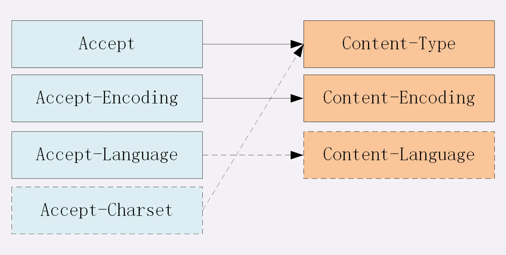

2)增加很多命令（POST、PUT、DELETE）

> 幂等性：同样的请求被执行一次与连续执行多次的效果是一样的，不会产生副作用

| Methond | 说明 |
| --- | --- |
| Get | 幂等性 |
| Post | 非幂等性（创建新的资源）|
| Put | 幂等性（更新已存在的资源）|
| Delete | 幂等性 |

3)并不是所有请求都能被服务器响应，引入状态码通知浏览器请求处理情况

4)减轻服务器压力，引入 Cache 机制，这个会用另外一篇文章做讲解

HTTP 1.1
1)新增 Host，实现虚拟主机

2)客户端Cookie ，安全机制

3)持久连接

HTTP 1.0 

采用简单模型进行连接，每次请求都需要经历建立连接、传输数据、断开连接这三步过程，对于连续的多请求的网站是很不友好的，后续新增了长连接（keep-alive）,每个域名维护6个TCP连接、CDN 实现域名分片机制提升文件传输速度。

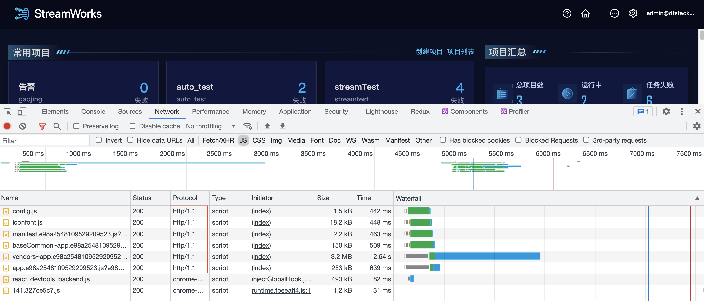
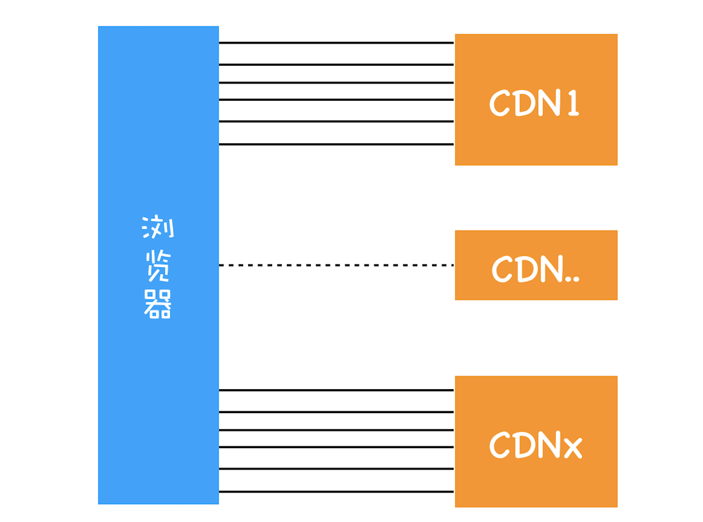

HTTP 2

HTTP 1.1 对多资源下载优化有一定对效果，但是带宽利用率仍不理想，导致原因主要有一下3点：

1）TCP 慢启动

2）同时开启多条 TCP 连接，存在宽带竞争

3）HTTP 队头阻塞
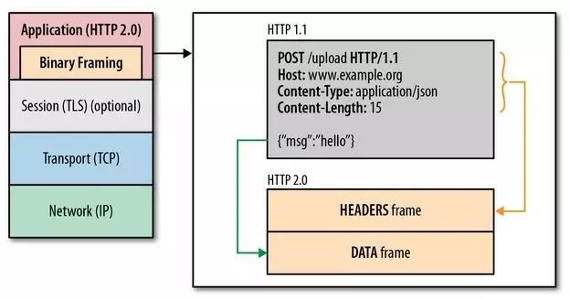
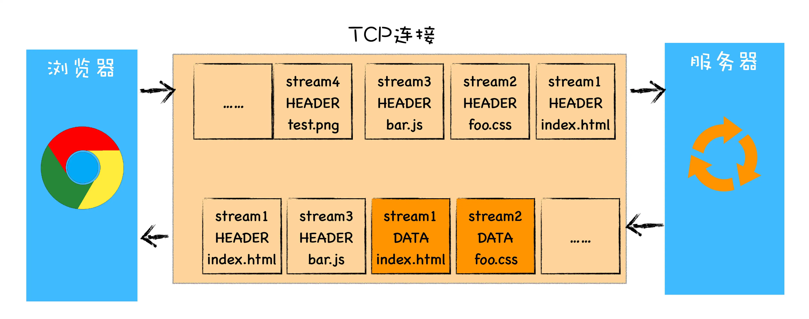
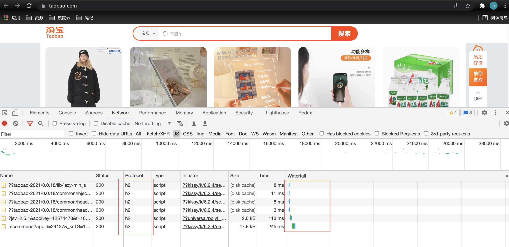
多路复用解决队头阻塞问题

服务器推送(html → css、js)

头部压缩(cookie)

请求优先级设置

HTTP 3

缺陷：TCP 队头阻塞

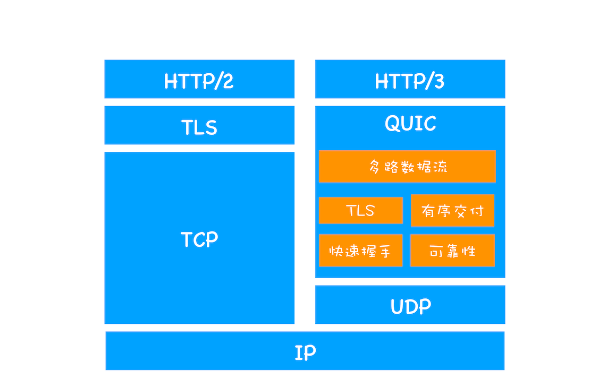
### 服务端处理 HTTP 请求
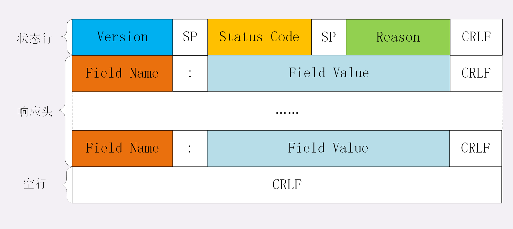
服务器返回响应行、响应头、响应体

1）重定向：返回状态码301、302时，网络进程会从 Location 字段获取重定向地址，重新发起HTTP/HTTPS 请求

2）响应数据处理：Content-Type

下载类型：请求提交至下载管理期，导航流程结束

HTML类型：渲染进程准备

3）通常服务器向客户端返回请求数据后就会关闭数据，我可以在头信息中加入如下字段保持连接打开。
> Connection:Keep-Alive
### 请求结束
断开连接：TCP四次挥手

FIN-WAIT-1：终止等待1

CLOSE-WAIT：关闭等待

FIN-WAIT-2：终止等待2

LAST-ACK：最后确认

TIME-WAIT： 时间等待

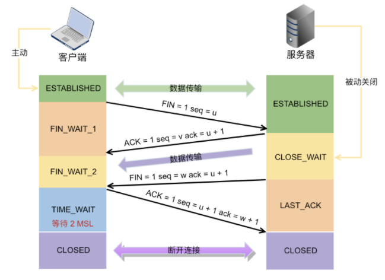
在整个流程中我们可以看出客户端关闭 TCP 连接是远远晚于服务端的，为什么客户端在最后会等待 2 MSL 呢？
> 保证客户端发送的最后一个ACK报文能够到达服务器，因为最后一个ACK报文可能丢失，站在服务器的角度看来，我已经发送了FIN+ACK报文请求断开了，客户端还没有给我回应，应该是我发送的请求断开报文它没有收到，于是服务器又会重新发送一次，而客户端就能在这个2MSL时间段内收到这个重传的报文，接着给出回应报文，并且会重启2MSL计时器。

## 提交文档
> 目的是浏览器进程将网络进程中接收到的 HTML 数据传给渲染进程完成网页渲染
1. 浏览器进程接收网络进程响应头数据后，并判断数据内容是 HTML 类型数据，向渲染进程发起‘提交文档’的消息；
2. 渲染进程收到‘提交文档’信息后，和网络进程建立 IPC 通信传输数据；
3. 数据传输完成后，渲染进程发送‘确认提交’给浏览器进程；
4. 浏览器收到‘确认提交’后更新：安全状态、地址栏 URL、前进后退历史状态、Web 界面；
5. 渲染进程页面解析和渲染，渲染更多细节查看浏览器渲染流程。

## 总结
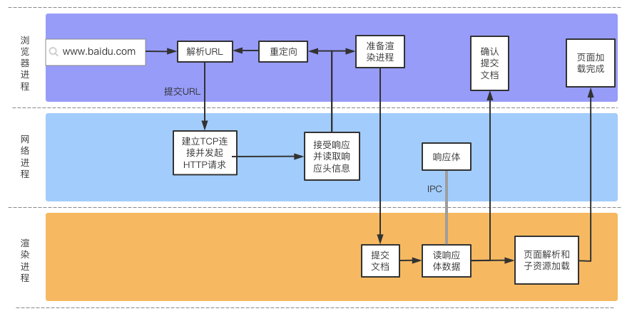